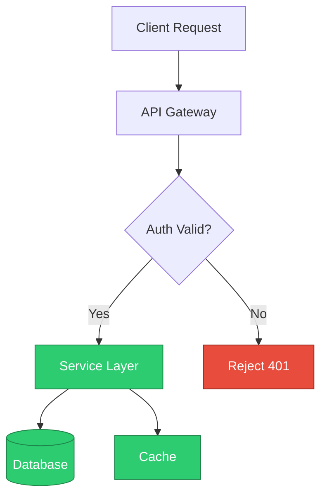

# Project Status Report

This document summarizes the current rollout plan, ownership, and the
service architecture for the Q3 release.

## Highlights

- Backend API is feature-complete and passing integration tests.
- Frontend dashboard is in code review, targeting merge this week.
- Infrastructure migration to the new cluster is scheduled for next sprint.
- Documentation is being generated automatically from source comments.

## Team Ownership

| Area           | Owner   | Status      |
|----------------|---------|-------------|
| Backend API    | Priya   | Done        |
| Frontend       | Marcus  | In review   |
| Infrastructure | Wei     | Scheduled   |
| Documentation  | Ana     | In progress |

## Architecture

